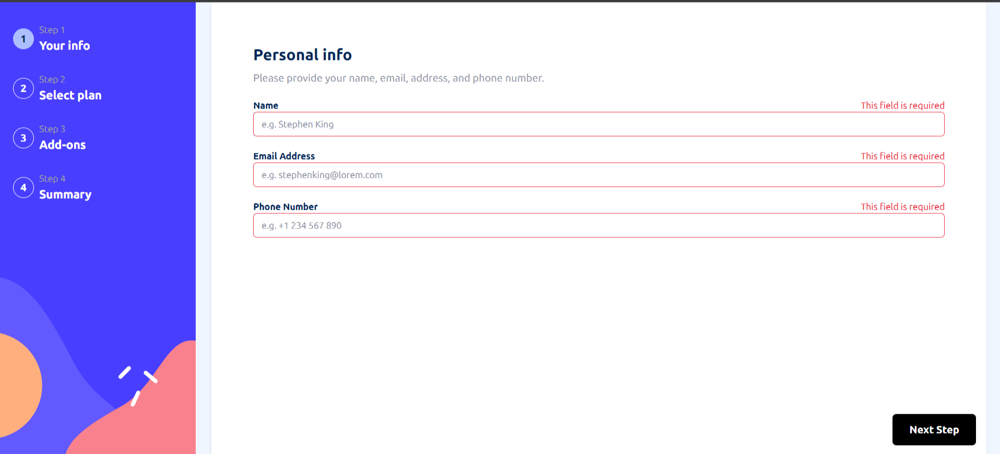

# Frontend Mentor - Multi-step form solution

This is a solution to the [Multi-step form challenge on Frontend Mentor](https://www.frontendmentor.io/challenges/multistep-form-YVAnSdqQBJ). Frontend Mentor challenges help you improve your coding skills by building realistic projects.

## Table of contents

- [Frontend Mentor - Multi-step form solution](#frontend-mentor---multi-step-form-solution)
  - [Table of contents](#table-of-contents)
  - [Overview](#overview)
    - [The challenge](#the-challenge)
    - [Screenshot](#screenshot)
    - [Links](#links)
  - [My process](#my-process)
    - [Built with](#built-with)
    - [What I learned](#what-i-learned)

**Note: Delete this note and update the table of contents based on what sections you keep.**

## Overview

- I used Next.js for this project, but I ended up with 90% of the components being client-side, which wasn't my initial intention. This approach has led to some challenges and inefficiencies. Moving forward, I hope to avoid this and aim for a more balanced or server-side approach to improve performance and maintainability.

### The challenge

Users should be able to:

- Complete each step of the sequence
- Go back to a previous step to update their selections
- See a summary of their selections on the final step and confirm their order
- View the optimal layout for the interface depending on their device's screen size
- See hover and focus states for all interactive elements on the page
- Receive form validation messages if:
  - A field has been missed
  - The email address is not formatted correctly
  - A step is submitted, but no selection has been made

btw: i think addons shouldn't be compulsory so i discarded the last requirement.

### Screenshot

### Links

- Solution URL: [click me](https://github.com/Bas3L3ss/frontend-challange-5-4-)
- Hosted App - [click me](https://frontend-challange-5-4.vercel.app/)

## My process

### Built with

- Semantic HTML5 markup
- Tailwind css
- Flexbox
- CSS Grid
- Mobile-first workflow
- [Next.js](https://nextjs.org/) - React framework

**Note: These are just examples. Delete this note and replace the list above with your own choices**

### What I learned

I've learned quite a lot, especially in honing my self-research skills. Additionally, I've gained more knowledge throughout the coding process.

- Github - [Bas3L3ss](https://github.com/Bas3L3ss)
- Frontend Mentor - [@Bas3L3ss](https://www.frontendmentor.io/profile/Bas3L3ss)
